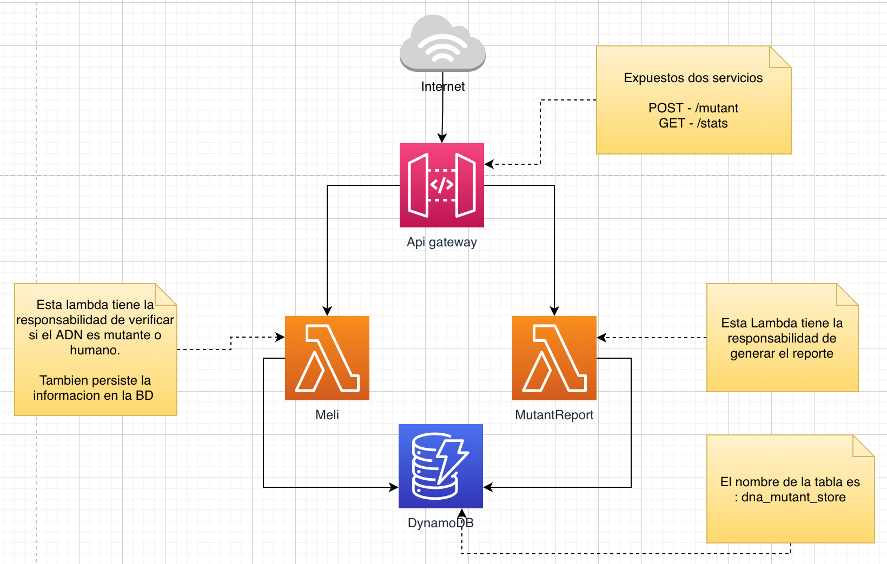
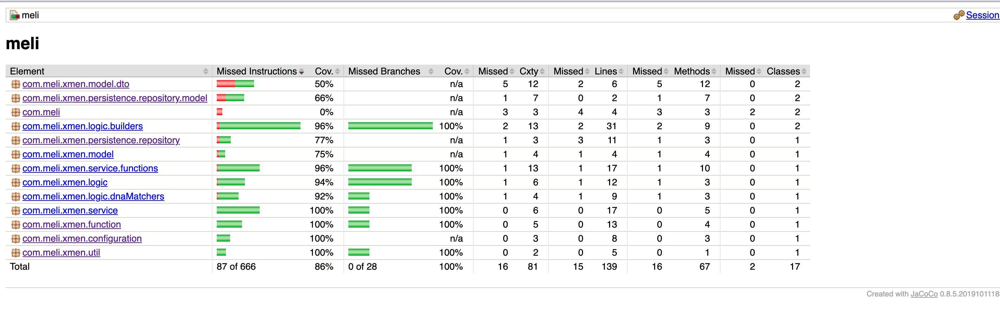

# Magneto Will Rule The World

De acuerdo al ejercicio detallado, este repo contiene todo el codigo 
y el detalle del componente implementado.

### Despligue y componentes

La aplicacion esta desplegada en aws.
 

La informacion de los endpoints sera enviada por correo.

Con el objetivo de mantener infraestrucutra y mantener bajos costos se
usan componentes serverless.

Es importante tener en cuenta que la configuracion de dynamo tiene 
los valores de lectura y escritura por defecto, es decir , casi no genera
costos. Si se quiere hacer un prueba bastante fuerte de carga se recomienda
pasar la la tabla consumo on-demand. Dado que esta desplegado en una cuenta 
con el free tier se solicita no cambiar estos valores.

### Detalle de las lambdas

En este repositorio hay 2 carpetas:

  |--- COMMAND  
  |--- QUERY
  
 #### Command
 
 Este componente tiene el codigo de la lambda donde verifica si el ADN es mutante 
 o humano.
 
 Esta construido con:
  - Spring cloud function
  - Java 8
  - Lombok
  - AWS SDK
  - Junit
  - Mockito 
  - Gson
  - Gradle
  
 Para Desplegarlo hay que ejecutar el comando
 **./gradlew shadowJar** 
 
 En la carpeta **build/libs/** se va genera el jar que se debe desplegar 
 en la consola de aws, en las lambdas.
 
 Un ejemplo de jar generado es: build/libs/meli-2.0.0.RELEASE-aws.jar
 
 TESTING Y COVERAGE
 
 Para ejecutar las pruebas unitarias y validar el coverage se debe ejecutar el comando
 **./gradlew test**
 
 El reporte queda generado en : build/jacoco/test/html/index.html
 
 El actual reporte tiene el siguiente estado:
 
 
